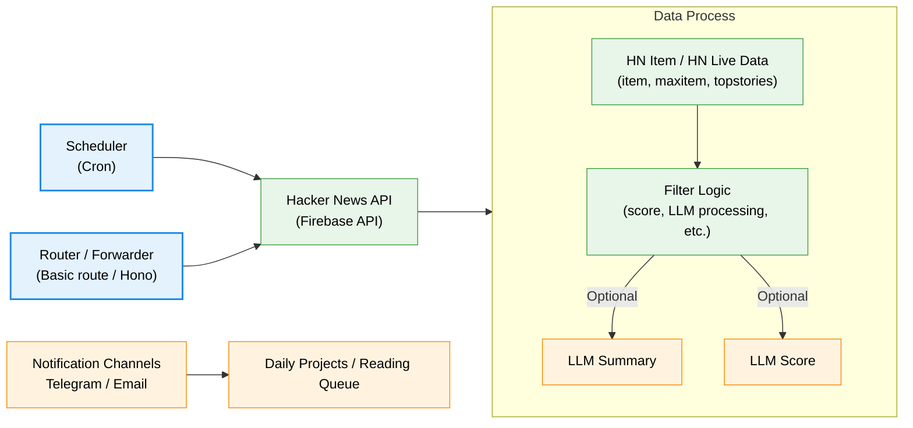

# Hacker News Worker

Hacker News Worker is a [Cloudflare Workers](https://developers.cloudflare.com/workers/) (totally written in TypeScript) service that fetches and processes Hacker News data (e.g. Top Stories🔥), then forwards selected items to downstream channels such as Telegram bot, email, webhooks, or persistent databases.

This project is based on the Python project [phil-r/hackernewsbot](https://github.com/phil-r/hackernewsbot). The original project runs on Google App Engine (GAE) platform and is written in Python 2. Thank you phil-r for creating such a tool!

## Features

- Scheduled jobs via [Cloudflare Workers Cron Triggers](https://developers.cloudflare.com/workers/configuration/cron-triggers/).
- Fetches Hacker News items from the official Firebase API ([HN API](https://github.com/HackerNews/API) wrapper).
- Filtering top stories and de-duplication via [Cloudflare Workers KV](https://developers.cloudflare.com/kv/).
- Telegram bot notifications via Telegram Bot API wrapper.
- Email notification via [Cloudflare Email Routing](https://developers.cloudflare.com/email-routing/)
- Pluggable layer with placeholders for LLM intergration and other notification.

## How to run your own hacker-news-worker

<p align="center">
  <a href="https://deploy.workers.cloudflare.com/?url=https://github.com/edwardzcn-decade/hacker-news-worker"></a>
</p>

- Clone this project or just click deploy button
- Build and deploy this worker from [Cloudflare Dashboard](https://deploy.workers.cloudflare.com/)
- Register your Telegram bot via [BotFather](https://telegram.me/BotFather) and remember your **bot token**
- Run `npx wrangler secret put TG_BOT_TOKEN` to put your bot token
- Search `xxx@example.me` and `xxx@example.com` in `wrangler.json` and `email.ts` and replace them with your own registered/verified email address
- Update your own repository, rebuild and deploy the worker through dashboard or use `npx wrangler types && npx wrangler deploy`

### Local development

Run `npx wrangler dev` and read the [Cloudflare Docs](https://developers.cloudflare.com/workers/get-started/guide/) for more information.

### Scheduled Jobs

> [!NOTE]For local deveplopment
>
> When use `npx wrangler dev` to run the worker locally. The scheduled jobs (e.g.  every ten minutes) wont be triggered unless you call the special endpoint. You need to manually trigger them yourself.
>
> If you see this log:
> ```text
> ⎔ Starting local server...
> [wrangler:info] Ready on http://localhost:8787
> ```
>
> That means the local worker is successfully running on port 8787. Use `curl "http://localhost:8787/cdn-cgi/handler/scheduled"` to trigger the scheduled job (with empty cron name).

The cron expression appearing in switch-case branches in `scheduled` handler should be consistent with your `triggers.crons` configuration.

As shown in the template, in `wrangler.jsonc` we set:

```json
{
	"triggers": {
		"crons": ["*/10 * * * *", "30 9 * * mon,wed,fri"]
	}
}
```

If you change them, make sure the expressions after `case` are updated as well.

```ts
switch (controller.cron) {
	case "*/10 * * * *": // match the first cron job
		await runJob(env);
		break;
	case "30 9 * * mon,wed,fri":
		// 09:30 UTC every Monday, Wednesday and Friday
		await runAnother(env): // match the second cron job
		break
	default:
    break
}
```


## Roadmap

- [x] Scheduler trigger with Cron job
- [x] Data filter
- [x] Telegram notifications
- [x] Basic KV caching and de-duplication
- [x] Email notifications
- [ ] ~~Webhook / database sink integration~~
- [ ] ~~(Optional) Implement LLM-based summaries~~
- [ ] ~~(Optional) Implement LLM-based scoring and ranking~~

## Flowchart



## LICENSE

MIT